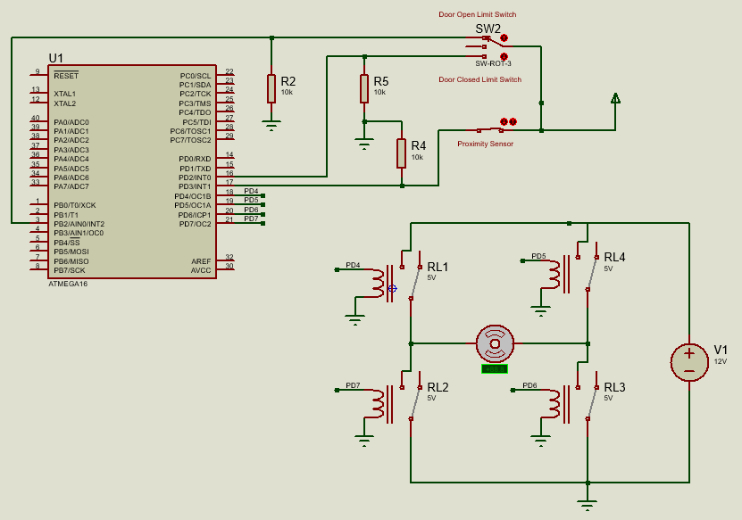

# Automatic Door Control using ATMega16

## Prerequisties to compile and flash the program to MCU

### Windows

- Download and extract [AVR GNU Toolchain ](https://www.microchip.com/mplab/avr-support/avr-and-arm-toolchains-c-compilers) for Windows and add the `bin` directory to `PATH` Windows Environment variable.
- Download and extract [avrdude](http://download.savannah.gnu.org/releases/avrdude/avrdude-6.3-mingw32.zip) to any location on your PC. Add the folder to Windows Environment variable `PATH`.

### Debian/Ubuntu Linux

- Install `gcc-avr`, `avr-libc`, `make` and `avrdude`

```
$ sudo apt -y install gcc-avr avr-libc make avrdude
```
### Compilation
- Use the following command to compile and create the HEX file in folder `build`
    ```
    make all
    ```
- Alternatively, Atmel Studio 7 project files are available.

### Flashing to MCU using [USBasp](https://www.fischl.de/usbasp/)

- Use ```make flash``` to dump the created HEX file into your MCU. Script in `Makefile` uses `avrdude` and `USBasp`.

## Circuit 


## Proteus Simulation

- Use the [Proteus](https://www.labcenter.com/simulation/) file to simulate what has been described without using actual hardware.